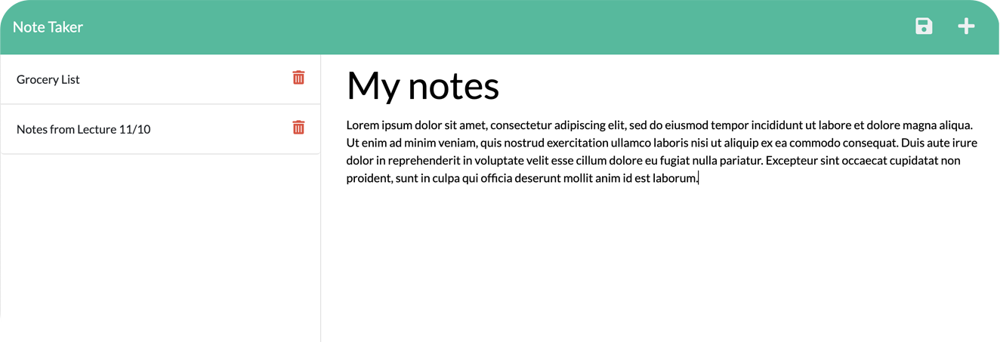

# Note Taker

## Description

A simple app with an Express/Node.js server implementation, wherein users can view, compose, save, and delete text notes. Note data is stored on the server in a .json file. The project includes the following features in accordance with the challenge guidelines:
- Proper setup of the `.gitignore` file to prevent `node_modules` and other extraneous system files from being tracked.
- Use of **Express.js** to implement the server architecture.
- Use of **modular routing** to compartmentalize endpoints.
- Implementation of `GET`, `POST`, and `DELETE` API routes for use by a preexisting front end.
- Implementation of a **wildcard route** to catch erroneously entered endpoints.
- Use of Node's `fs` module to read, write, and delete note data.
- Use of the `uuid` npm package to assign unique identifiers to individual notes.

## Usage

A deployed instance of the app is available [here on Heroku](https://radiant-forest-02676.herokuapp.com/).

Usage instructions:
- To add a new note, click the '+' symbol in the upper right corner of the UI, and type your desired title and body in the appropriate fields. 
- When both fields contain text, a disk icon will appear in the UI, which will allow you to save your note. 
- View saved notes by clicking on their titles in the menu on the left-hand side of the interface. 
- Delete a note by clicking the trash can icon next to its title.

## Credits

This project is designed to showcase the developer's ability to design an Express.js back-end, and link it to a preexisting web front-end. All code in the `public/` directory was therefore provided by the UofM Coding Bootcamp (Trilogy Education Services), while the rest of the code (including `server.js` and all files in `routes/`) was written by the developer.

## License

Please refer to the LICENSE in the repo.